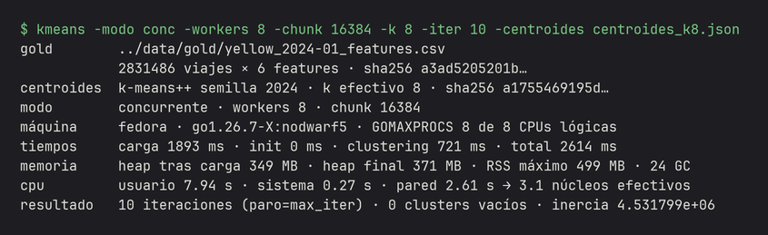
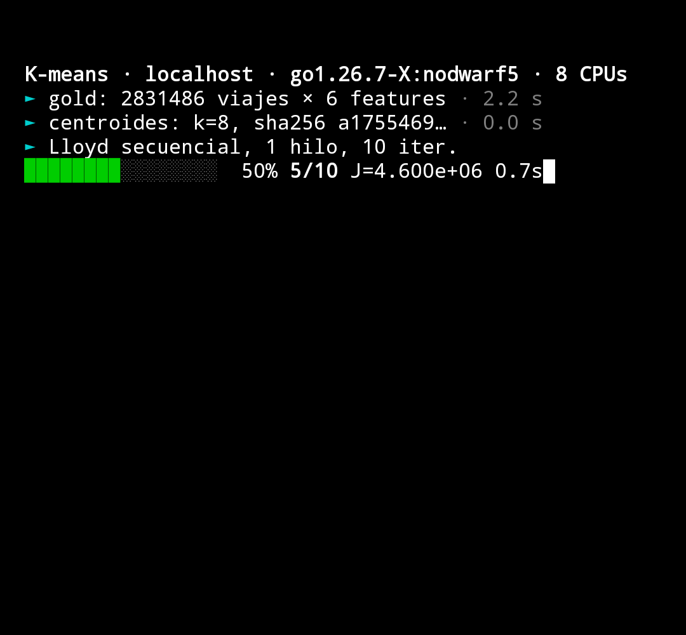

<a id="inicio"></a>

<div align="center">

<h1>concurrente</h1>

<p>
  <strong>K-means concurrente en Go sobre 2,8 millones de viajes de taxi de Nueva York</strong>,<br>
  verificado con Promela/Spin y medido en cuatro máquinas, del servidor al celular.
</p>

<p>
  Cuaderno del curso <em>Programación Concurrente y Distribuida</em> (UPC 1ACC0065, ciclo 2026-20)
</p>

<p>
  
  
  
  
</p>

<p>
  <a href="#resultados">Resultados</a> ·
  <a href="#empezar">Empezar</a> ·
  <a href="tp/docs/analisis-pc2.md">Análisis de la PC2</a> ·
  <a href="tp/docs/analisis-gpu.md">Contraste en GPU</a> ·
  <a href="tp/docs/pixel.md">En un celular</a>
</p>

</div>

<details>
  <summary>Contenido</summary>
  <ol>
    <li><a href="#que-es">Qué es</a></li>
    <li><a href="#resultados">Resultados</a></li>
    <li><a href="#como-esta-hecho">Cómo está hecho</a></li>
    <li><a href="#empezar">Empezar</a></li>
    <li><a href="#mapa">Mapa del repo</a></li>
    <li><a href="#curso">El curso</a></li>
    <li><a href="#convenciones">Convenciones</a></li>
    <li><a href="#equipo">Equipo</a></li>
  </ol>
</details>

<a id="que-es"></a>

## Qué es

<p align="center">
  
</p>

El Trabajo Parcial agrupa los viajes del taxi amarillo de Nueva York de enero de 2024 (datos abiertos
de la TLC) en tipos de viaje según hora, día, duración y distancia, para caracterizar la movilidad
urbana en línea con el ODS 11. El algoritmo es K-means de Lloyd, en dos versiones que comparten el
mismo contrato numérico:

| Versión | Cómo reparte el trabajo | Sincronización |
|---|---|---|
| Secuencial | Un solo hilo recorre los 2,8 M viajes | Ninguna |
| Concurrente | *Worker pool* persistente; un canal reparte bloques de viajes | Acumuladores privados por bloque y una barrera `sync.WaitGroup` por iteración |

Sin librerías de terceros, como exige el curso. Alrededor del algoritmo hay un pipeline de datos en
Python (bronze → silver → gold con auditoría en SQL), un modelo en Promela que Spin verifica sobre
todos los entrelazados, y un benchmark con protocolo estadístico fijado en código.

<p align="right">(<a href="#inicio">volver arriba</a>)</p>

<a id="resultados"></a>

## Resultados

Mismo gold, mismos centroides iniciales y mismo protocolo en todas las máquinas: 20 repeticiones con
orden barajado, media recortada al 10 % e intervalos de confianza por bootstrap.

| Entorno | Secuencial | 4 workers | 8 workers | Mejor |
|---|---:|---:|---:|---:|
| VM en Proxmox: Ryzen 5 7600X (6 núcleos), 11 vCPU, 9 GB de RAM | 1,1 s | 3,80× | 5,82× | 6,25× con 16 |
| PC de escritorio en WSL2: i7-10700 (8 núcleos, 16 hilos), 15 GB de RAM | 1,7 s | 3,42× | 6,12× | 7,88× con 16 |
| Laptop: i5-10210U (4 núcleos, 8 hilos), 15 GB de RAM, enchufada | 2,3 s | 3,29× | 3,27× | techo en los 4 núcleos físicos |
| **Pixel 9a** con Termux: Tensor G4 (1 + 3 + 4 núcleos), 7,4 GB de RAM | 3,6 s | 3,50× | 3,95× | techo en los 4 núcleos grandes |
| GPU RTX 4060 (8 GB) del mismo PC, PyTorch en fp32 | | | | 8,73× frente al secuencial, 1,11× frente a 16 hilos |

- **El resultado concurrente es idéntico bit a bit** para cualquier cantidad de workers y en los cuatro
  entornos medidos, x86 y ARM: inercia 4531798,747970126. La reducción suma los parciales siempre en
  el mismo orden.
- **La concurrencia paga desde unos 20 000 viajes.** Por debajo, el costo de armar el pool supera el
  trabajo útil. El dataset está 140 veces por encima de ese punto.
- **El límite es coordinar, no una sección secuencial.** La fracción serial efectiva crece con los
  workers, así que el techo de Amdahl no sirve como predicción.
- **La GPU de consumo no le gana a 16 hilos en doble precisión** (0,55×). En simple precisión gana
  por poco y cambia de cluster el 0,2 % de los viajes.

<p align="center">
  
  <br><sub>El mismo binario, compilado para Android, a mitad de corrida en un Pixel 9a.</sub>
</p>

<p align="right">(<a href="#inicio">volver arriba</a>)</p>

<a id="como-esta-hecho"></a>

## Cómo está hecho

```
TLC (Parquet) ──► bronze ──► silver ──► gold (CSV, 6 features)
                  Polars: 7 reglas      │  DuckDB re-verifica en SQL
                                        ▼
                     tp/kmeans (Go) ──► secuencial / worker pool ──► tp/reports/*.json
                            │                                           │
                     tp/spin (Promela)                        tp/scripts ──► tablas del informe
                     verifica la sincronización               (ninguna cifra a mano)
```

> [!NOTE]
> **Verificar y probar son cosas distintas, y hacen falta las dos.** Spin recorre todos los
> entrelazados de un modelo reducido y confirma que ningún punto se pierde ni se duplica; un mutante
> con un acumulador compartido demuestra que el modelo detecta la carrera. `go test -race` prueba la
> implementación en cada pull request.

> [!IMPORTANT]
> Los datos no se versionan. `tp/data/` se genera con el pipeline, y `materials/` (el material del
> Aula Virtual, que es del profesor) se reconstruye desde el índice de `manifest.json`.

<p align="right">(<a href="#inicio">volver arriba</a>)</p>

<a id="empezar"></a>

## Empezar

**Requisitos:** Go 1.26, [uv](https://docs.astral.sh/uv/) y, para los modelos, Spin 6.5
(`labs/spin/bootstrap.sh` lo compila sin sudo).

**1. Datos.** Descarga el mes de TLC, lo limpia y escribe el gold:

```bash
cd tp
uv sync --extra dev
uv run nyc-tlc all      # unos 2 minutos, casi todo es la descarga
uv run pytest -q
```

Debería terminar con `tp/data/gold/yellow_2024-01_features.csv` de 2 831 486 viajes y el reporte en
`tp/reports/limpieza_yellow_2024-01.md` con 0 violaciones en la auditoría.

**2. El K-means.** Las dos versiones, con barra de progreso:

```bash
cd tp/kmeans
go test -race ./...
go run ./cmd/kmeans -modo seq  -k 8 -iter 10 -centroides /tmp/c.txt -progreso
go run ./cmd/kmeans -modo conc -k 8 -iter 10 -centroides /tmp/c.txt -progreso -workers 8
```

Las dos corridas tienen que terminar con la misma inercia, `4.531799e+06`. La primera genera los
centroides iniciales en `/tmp/c.txt` y la segunda los reusa.

**3. El benchmark.** El protocolo completo, unos 11 minutos en una máquina de 11 núcleos:

```bash
go run ./cmd/benchmark      # escribe tp/reports/benchmark_<máquina>_<fecha>.json
```

**4. La verificación.**

```bash
cd tp/spin && make check    # 0 errores en el modelo correcto, 1 en el mutante
```

<p align="right">(<a href="#inicio">volver arriba</a>)</p>

<a id="mapa"></a>

## Mapa del repo

| Ruta | Qué hay |
|------|---------|
| `tp/` | Trabajo Parcial: pipeline de datos, `kmeans/` en Go, `spin/`, benchmarks, informes en LaTeX y documentación en `docs/`. Contexto completo en [`tp/CLAUDE.md`](tp/CLAUDE.md). |
| `labs/go/` | Laboratorios de Go, un paquete por semana. |
| `labs/spin/` | Laboratorios de Promela verificados con Spin. |
| `notes/` | Apuntes por sesión. |
| `manifest.json` | Inventario del curso: temario, cronograma de evaluación y el índice del material del Aula Virtual. |
| `docs/` | Propuestas de caso de uso del TP. |

<p align="right">(<a href="#inicio">volver arriba</a>)</p>

<a id="curso"></a>

## El curso

| Unidad | Semanas | Tema |
|--------|---------|------|
| 1 | 1 a 8 | Construcción y verificación de aplicaciones concurrentes: Go, sección crítica, semáforos, patrones, model checking con Spin |
| 2 | 9 a 16 | Computación distribuida: canales, servicios y algoritmos distribuidos, exclusión mutua distribuida, consenso, tiempo real |

| Evaluación | Semana | Peso |
|------------|--------|------|
| PC1, PC2 | 3, 5 | 10 % cada una |
| TB1 | 7 | 5 % |
| EA1 | 8 | 10 % |
| PC3, PC4 | 11, 13 | 10 % cada una |
| TB2, DD1 | 15 | 15 % cada una |
| EB1 | 16 | 15 % |

<p align="right">(<a href="#inicio">volver arriba</a>)</p>

<a id="convenciones"></a>

## Convenciones

- **TDD**: el test antes que la goroutine o el modelo. Toda prueba de concurrencia corre con `-race`.
- **Git Flow**: nada entra directo a `develop` ni a `main`. Una rama por unidad de trabajo, PR
  revisada, y una fusión a `main` por entregable, con tag (`pc1`, `pc2`, …).
- **Ninguna cifra a mano**: las tablas de los informes se generan desde `tp/reports/*.json`.
- **Tareas en beads** (`bd ready`), no en TODOs sueltos.
- **IA como herramienta del curso**: el sílabo incorpora prompt engineering para diseñar algoritmos
  concurrentes e interpretar Spin, siempre contrastando contra la teoría; el uso se registra en el TP.

Las reglas completas están en [`CLAUDE.md`](CLAUDE.md).

<p align="right">(<a href="#inicio">volver arriba</a>)</p>

<a id="equipo"></a>

## Equipo

<div align="center">
<table>
  <tr>
    <td align="center" width="170">
      <a href="https://github.com/R0SEWT">
        <br>
        <b>Rody Vilchez</b><br><sub>@R0SEWT · coordinador</sub>
      </a>
    </td>
    <td align="center" width="170">
      <a href="https://github.com/dnnygz">
        <br>
        <b>Dayana Gómez</b><br><sub>@dnnygz</sub>
      </a>
    </td>
    <td align="center" width="170">
      <a href="https://github.com/ElJulioGG">
        <br>
        <b>Julio Meza</b><br><sub>@ElJulioGG</sub>
      </a>
    </td>
  </tr>
</table>
</div>

<p align="center"><sub>Programación Concurrente y Distribuida · UPC · 2026-20 · Docente: Carlos Alberto Jara García</sub></p>

<p align="right">(<a href="#inicio">volver arriba</a>)</p>
