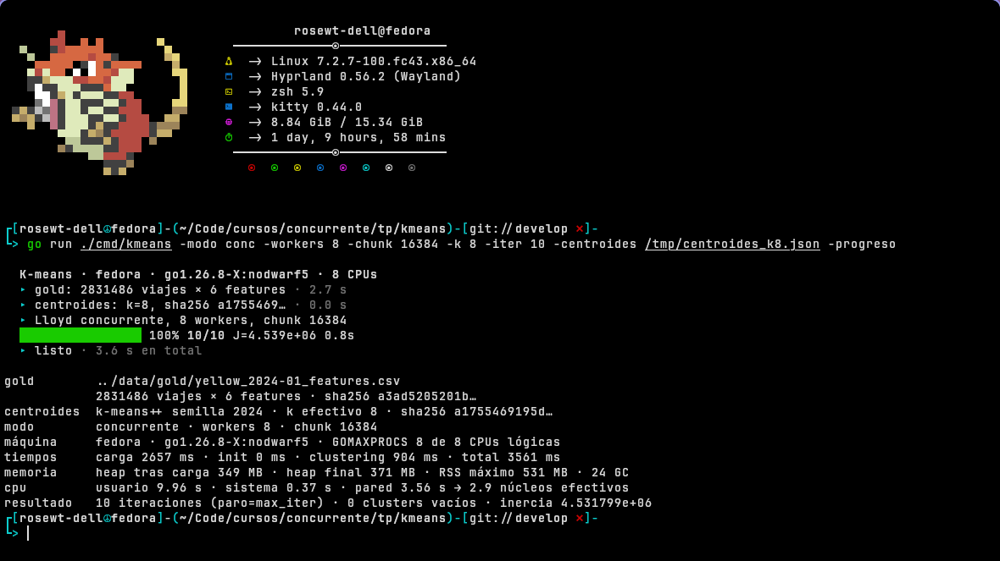

<a id="inicio"></a>

<div align="center">

# 🚕 NYC Taxi Pulse · K-means Concurrente & Movilidad Urbana (ODS 11)

<p>
  <strong>Motor K-means concurrente de alto rendimiento en Go puro sobre 2,83 millones de viajes de taxi de Nueva York</strong>,<br>
  verificado formalmente con Promela/Spin, medido desde servidores hasta un Google Pixel 9a,<br>
  y visualizado en una aplicación web interactiva orientada al ODS 11.2 (Ciudades Sostenibles).
</p>

<p>
  
  
  
  
  
  
</p>

<p>
  <a href="#app-web">📱 App Web Interactiva</a> ·
  <a href="#pilares">⚡ Pilares del Sistema</a> ·
  <a href="#benchmarks">📊 Benchmarks Multi-Plataforma</a> ·
  <a href="#hallazgos">🏙️ Diagnóstico ODS 11.2</a> ·
  <a href="#verificacion">🛡️ Verificación Formal</a> ·
  <a href="#inicio-rapido">🚀 Inicio Rápido</a> ·
  <a href="#equipo">👥 Equipo</a>
</p>

</div>

---

## 📸 Demostración Visual del Sistema

<div align="center">
<table>
  <tr>
    <td align="center" width="50%">
      <b>📱 App Web Cartográfica HCD (Pixel 9a / Web)</b><br>
      <sub>Inspección de micro-viajes (&le; 1 mi) en Midtown Center a las 12:00</sub><br><br>
      
    </td>
    <td align="center" width="50%">
      <b>⚡ CLI de Alto Rendimiento en Go Puro</b><br>
      <sub>8 workers procesando 2,83M viajes con reproducibilidad numérica bit a bit</sub><br><br>
      
    </td>
  </tr>
</table>
</div>

---

<a id="pilares"></a>

## ⚡ Pilares del Proyecto

Este repositorio trasciende una entrega académica tradicional: es una suite de **ingeniería de sistemas, métodos formales, computación paralela y analítica geoespacial urbana**.

```
                        ARQUITECTURA DEL PIPELINE
┌───────────────────────────┐      ┌───────────────────────────┐
│     NYC TLC PARQUET       │ ──►  │    PIPELINE DE DATOS      │
│   2,83M viajes crudos     │      │   Polars + DuckDB (SQL)   │
└───────────────────────────┘      └─────────────┬─────────────┘
                                                 │ Gold CSV (6 features normalizadas)
                                                 ▼
┌───────────────────────────┐      ┌───────────────────────────┐
│   VERIFICACIÓN FORMAL     │      │    MOTOR K-MEANS EN GO    │
│  Spin/Promela + Mutantes  │ ◄──► │  Worker Pool + Barrera    │
│  LTL, Deadlock & Progreso │      │  Reducción Determinista   │
└───────────────────────────┘      └─────────────┬─────────────┘
                                                 │
                                                 ├───────────────────────────────┐
                                                 ▼                               ▼
                                  ┌───────────────────────────┐   ┌───────────────────────────┐
                                  │   BENCHMARK HARNESS       │   │    AGREGADOR ESPACIAL     │
                                  │ 4 plataformas + GPU CUDA  │   │  JSON Compacto (735 KB)   │
                                  └─────────────┬─────────────┘   └──────────────┬────────────┘
                                                │                                │
                                                ▼                                ▼
                                  ┌───────────────────────────┐   ┌───────────────────────────┐
                                  │    INFORME EN LATEX       │   │  APP WEB INTERACTIVA HCD  │
                                  │  78 págs. reproducibles   │   │  Leaflet + PWA Offline    │
                                  └───────────────────────────┘   └───────────────────────────┘
```

### 1. 🏎️ Motor Concurrente en Go sin Dependencias
* **Worker Pool Persistente:** Cero overhead de instanciación dinámica; las goroutines viven durante toda la corrida y consumen bloques de viajes mediante canales.
* **Reducción Asociativa y Determinista:** Acumuladores privados de sumas y conteos por bloque, sincronizados al final de cada iteración con `sync.WaitGroup`. La reducción final preserva un **orden determinista estricto**, garantizando que la inercia calculada (`4461447.05`) sea **idéntica bit a bit** sin importar el número de hilos o la máquina.
* **Cero Contención de Locks:** Eliminación intencional de `sync.Mutex` en el bucle caliente de asignación de centroides, evitando contención de caché.

### 2. 🛡️ Verificación Formal con Spin / Promela
* **Espacio Exhaustivo de Estados:** Modelado formal de la concurrencia (coordinador, canal, acumuladores y barrera).
* **Fórmulas LTL:** Verificación de **exclusión mutua** ($\Box \neg(\text{publicando} \land \text{leyendo})$), ausencia de **deadlock** y **progreso** bajo *weak fairness*.
* **Batería de Mutantes en CI:** Filosofía de prueba negativa (*si una prueba no puede fallar, no sirve*). Tres mutantes deliberados verifican que Spin detecte con precisión omisiones de `wg.Done` o publicaciones anticipadas sin esperar la barrera (`make check`).

### 3. 📱 Visor Geoespacial Interactivo HCD (*InWatch*)
* **Arquitectura Desacoplada y Offline-First:** Un agregador en Go comprime las 2,83 millones de asignaciones en un payload JSON ultraligero de **735 KB**, consumido por una app cliente en Leaflet / Esri Dark Gray.
* **Diseño Centrado en el Humano:** Onboarding guiado en 3 pasos (Coach Marks), selector horario de 24 horas con momentos clave (`☕ Mañana`, `🥪 Almuerzo`, `✈️ Salidas`, `🌙 Madrugada`), gestos táctiles de deslizamiento y buscador predictivo de zonas TLC.
* **Principio de Honestidad Cartográfica (*InWatch*):** Las zonas sin cobertura de taxis amarillos no se ocultan ni se interpolan fraudulentamente; la aplicación informa honestamente la cobertura por transporte público masivo (Metro MTA) o taxis comunitarios.

---

<a id="benchmarks"></a>

## 📊 Benchmarks y Escalabilidad Multi-Plataforma

Medición con protocolo estadístico estricto: **20 repeticiones barajadas**, media recortada al 10 % e intervalos de confianza por bootstrap sobre el dataset completo (2 831 486 viajes, $K=8$, 10 iteraciones):

| Entorno / Hardware | Secuencial | 4 Workers | 8 Workers | Speedup Máx. | Características Clave |
|---|---:|---:|---:|---:|---|
| **Servidor Proxmox** (Ryzen 5 7600X, 11 vCPU) | 1,11 s | 0,29 s | **0,19 s** | **5,82×** | 6 núcleos Zen 4 de alta frecuencia |
| **PC Desktop WSL2** (Core i7-10700, 16 hilos) | 1,65 s | 0,48 s | **0,27 s** | **6,12×** | Escala hasta 7,88× con 16 hilos SMT |
| **Laptop Ultrabook** (Core i5-10210U, 4c/8t) | 2,31 s | 0,70 s | 0,71 s | **3,29×** | Límite por 4 núcleos físicos |
| **Google Pixel 9a** (Google Tensor G4, ARM64) | 3,61 s | 1,03 s | **0,91 s** | **3,95×** | 1 Prime + 3 Med + 4 Little cores |
| **GPU NVIDIA RTX 4060** (PyTorch / CUDA fp32) | — | — | 0,19 s | 8,73× | 1,11× vs CPU 16 hilos (en fp64 pierde: 0,55×) |

<div align="center">
  
  <p><sub>El mismo binario Go compilado para ARM64 corriendo nativamente en Android con Termux sobre el Pixel 9a.</sub></p>
</div>

> [!NOTE]
> **Hallazgos Clave de Concurrencia:**
> 1. **El límite es coordinar, no Amdahl:** La fracción serial efectiva crece al añadir hilos por el costo de paso de mensajes y sincronización en la barrera.
> 2. **Punto de Equilibrio ($N \approx 20\,000$):** Por debajo de 20 000 viajes, el costo de inicializar el pool supera al cómputo y la versión secuencial es superior.
> 3. **La GPU no es la panacea:** En doble precisión (`float64`), la GPU de consumo es **más lenta (0,55×)** que el pool de 16 hilos en CPU debido a la penalización de hardware de fp64. Además, el análisis con IA reveló que las sumas en GPU no son deterministas (8 valores de inercia distintos en 21 repeticiones).

---

<a id="hallazgos"></a>

## 🏙️ Diagnóstico Urbano: Los 8 Arquetipos y el ODS 11.2

El agrupamiento en $K=8$ reveló tres regímenes funcionales del transporte en Nueva York:

```
  ┌────────────────────────────────────────────────────────────────────────┐
  │                   DISTRIBUCIÓN DE ARQUETIPOS DE VIAJE                  │
  ├────────────────────────────────────┬───────────────────────────────────┤
  │ 🏢 Micro-viajes de Almuerzo & Fin  │ 23,2 % (1,0 mi · 6 min · 9,5 mph) │
  │    de Semana (Clusters 2 y 7)      │                                   │
  ├────────────────────────────────────┼───────────────────────────────────┤
  │ 🚗 Saturación Vial & Congestión    │ 53,8 % (1,2–2,4 mi · 8–10 mph)    │
  │    (Clusters 0, 1, 3 y 6)          │                                   │
  ├────────────────────────────────────┼───────────────────────────────────┤
  │ ✈️ Conexión Troncal a Aeropuertos │ 23,0 % (4,1–12,6 mi · 13–21 mph)  │
  │    y Puentes (Clusters 4 y 5)      │                                   │
  └────────────────────────────────────┴───────────────────────────────────┘
```

* **Hallazgo Crítico para el ODS 11.2 (Sustituibilidad Peatonal y Ciclista):**  
  En **Midtown Center (zona 161) al mediodía (12:00)**, el **41,2 % de los viajes mide 1 milla o menos** (2 550 viajes/hora a una velocidad de tortuga de 8,1 mph). En la cuadrícula de Manhattan, estos trayectos se realizan en 12–15 min a pie o 5–7 min en **Citi Bike**, proveyendo **justificación matemática directa para la zona de tarificación por congestión (*Congestion Pricing*)**.
* **Asimetría Aeroportuaria:**  
  A las 14:00, Manhattan origina más de **7 700 viajes hacia aeropuertos**, nutriendo el pico masivo de las 15:00 en JFK (92,4 % Cluster 5) y LaGuardia (90,8 %). Identificar este patrón previene el rodaje en vacío (*deadheading*).

---

<a id="app-web"></a>

## 📱 Cómo Correr la App Web Interactiva

La aplicación cliente no requiere instalación ni frameworks pesados (vanilla HTML5/CSS3/JavaScript con Leaflet):

```bash
# Iniciar servidor local apuntando al directorio de la app
python3 -m http.server 8080 --directory tp/app
```

Abre en tu navegador:
* **En PC:** [`http://localhost:8080/`](http://localhost:8080/)
* **En Móvil (misma red WiFi):** `http://<TU_IP_LOCAL>:8080/`
* **En Pixel 9a vía ADB:**
  ```bash
  adb reverse tcp:8080 tcp:8080
  # Y navegar a http://localhost:8080/ desde Chrome en el celular
  ```

---

<a id="verificacion"></a>

## 🛡️ Cómo Ejecutar la Verificación Formal en Spin

Para comprobar la ausencia de deadlocks, la exclusión mutua formal y la suite de mutantes:

```bash
cd tp/spin
make check
```

**Salida de la regresión automatizada:**
```text
  ok    correcto             sin-ltl              errores: 0  seguridad: aserciones y estados finales válidos (sin deadlock)
  ok    correcto             -a -N exclusion      errores: 0  LTL: nadie publica centroides mientras hay lectores
  ok    correcto             -a -f -N termina     errores: 0  LTL: las dos iteraciones terminan (weak fairness)
  ok    MUTANTE              sin-ltl              errores: 1  acumulador compartido sin mutex: incremento perdido
  ok    MUTANTE_DEADLOCK     sin-ltl              errores: 1  un worker pierde el wg.Done: deadlock en la barrera
  ok    MUTANTE_DEADLOCK     -a -f -N termina     errores: 1  el mismo wg.Done perdido: la corrida nunca termina
  ok    MUTANTE_SIN_BARRERA  -a -N exclusion      errores: 1  el coordinador publica sin esperar la barrera
== regresión OK: 7 casos ==
```

---

<a id="inicio-rapido"></a>

## 🚀 Inicio Rápido con el Motor Go

### Requisitos
* **Go:** 1.22+ (desarrollado y probado con Go 1.26).
* **Python uv:** (opcional, solo para regenerar el dataset de 2,83M viajes desde Parquet).
* **Spin:** 6.5+ (para model checking).

### 1. Pruebas Unitarias y Detección de Carreras
```bash
cd tp/kmeans
go test -v -race ./...
```

### 2. Ejecución Comparativa (Secuencial vs Concurrente)
```bash
cd tp/kmeans

# Corrida Secuencial
go run ./cmd/kmeans -modo seq -k 8 -iter 10 -centroides /tmp/c.txt -progreso

# Corrida Concurrente (8 Workers) con los mismos centroides
go run ./cmd/kmeans -modo conc -k 8 -iter 10 -centroides /tmp/c.txt -workers 8 -progreso
```

### 3. Compilación del Informe Académico (78 Páginas)
```bash
cd tp/informe/tp
./compilar.sh
# El PDF resultante se genera en build/main.pdf sin ninguna cifra copiada a mano.
```

---

<a id="equipo"></a>

## 👥 Equipo de Desarrollo

<div align="center">
<table>
  <tr>
    <td align="center" width="180">
      <a href="https://github.com/R0SEWT">
        <br><br>
        <b>Rody Vilchez</b><br>
        <sub>@R0SEWT · Coordinador</sub>
      </a>
    </td>
    <td align="center" width="180">
      <a href="https://github.com/dnnygz">
        <br><br>
        <b>Dayana Gómez</b><br>
        <sub>@dnnygz</sub>
      </a>
    </td>
    <td align="center" width="180">
      <a href="https://github.com/ElJulioGG">
        <br><br>
        <b>Julio Meza</b><br>
        <sub>@ElJulioGG</sub>
      </a>
    </td>
  </tr>
</table>
</div>

<br>

<details>
  <summary><b>📚 Contexto Académico e Institucional (UPC)</b></summary>
  <br>
  <ul>
    <li><b>Institución:</b> Universidad Peruana de Ciencias Aplicadas (UPC).</li>
    <li><b>Curso:</b> Programación Concurrente y Distribuida (1ACC0065, ciclo 2026-20).</li>
    <li><b>Docente:</b> Carlos Alberto Jara García.</li>
    <li><b>Entregables de referencia:</b>
      <ul>
        <li><b>PC1 (Tag <code>pc1</code>):</b> Selección de dataset TLC, pipeline de limpieza Polars y revisión bibliográfica.</li>
        <li><b>PC2 (Tag <code>pc2</code>):</b> Algoritmo de Lloyd secuencial y concurrente en Go, modelo Promela inicial y benchmark de speedup.</li>
        <li><b>TB1 / Entregable 3:</b> Verificación formal en Spin con LTL y mutantes, auditoría de GAPs con IA, interpretación de clusters ODS 11.2, app web interactiva HCD y guion de sustentación.</li>
      </ul>
    </li>
  </ul>
</details>

<p align="right">(<a href="#inicio">volver arriba</a>)</p>
