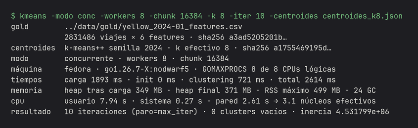
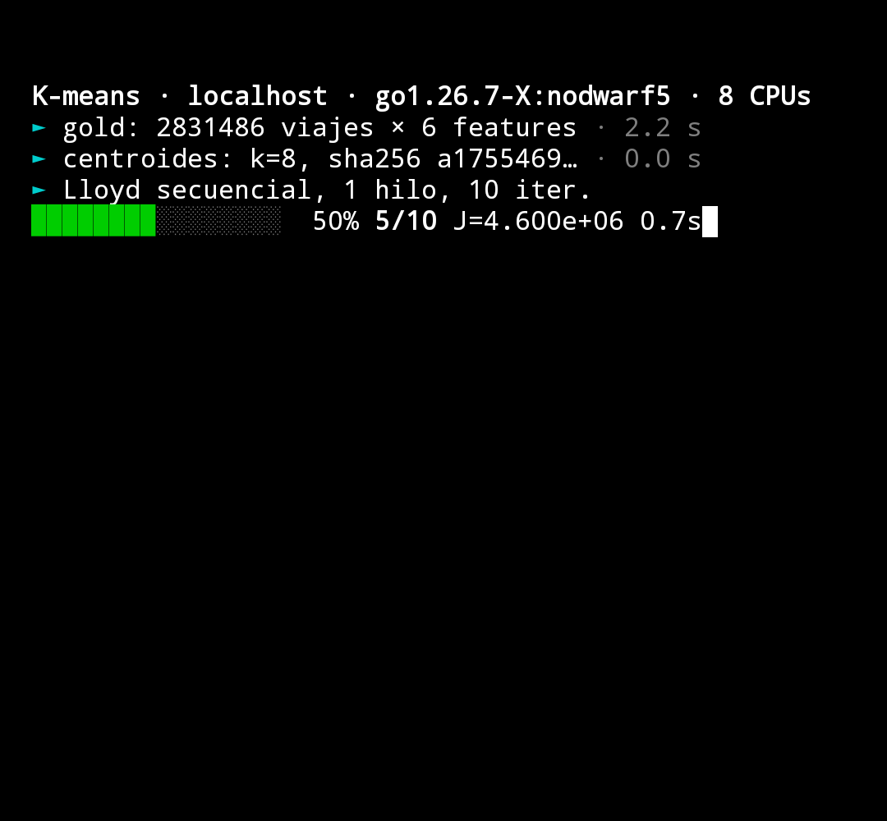
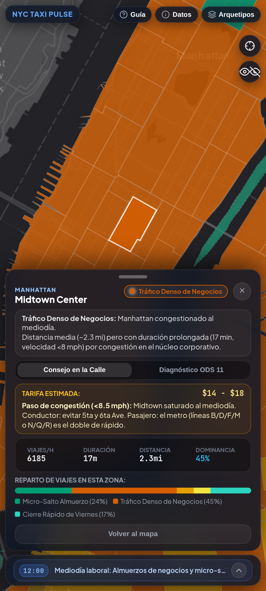

<a id="inicio"></a>

<div align="center">

<h1>concurrente</h1>

<p>
  <strong>K-means concurrente en Go sobre 2,8 millones de viajes de taxi de Nueva York</strong>,<br>
  verificado con Promela/Spin, medido en cuatro máquinas (del servidor al celular)<br>
  y explorado en un visor web interactivo para el ODS 11.
</p>

<p>
  
  
  
  
</p>

<p>
  <a href="#que-es">Qué es</a> ·
  <a href="#resultados">Resultados</a> ·
  <a href="#movilidad">Movilidad urbana (ODS 11)</a> ·
  <a href="#como-esta-hecho">Cómo está hecho</a> ·
  <a href="#empezar">Empezar</a> ·
  <a href="#mapa">Mapa del repo</a> ·
  <a href="#convenciones">Convenciones</a> ·
  <a href="#equipo">Equipo</a>
</p>

</div>

<details>
  <summary>Contenido</summary>
  <ol>
    <li><a href="#que-es">Qué es</a></li>
    <li><a href="#resultados">Resultados</a></li>
    <li><a href="#movilidad">Movilidad urbana (ODS 11)</a></li>
    <li><a href="#como-esta-hecho">Cómo está hecho</a></li>
    <li><a href="#empezar">Empezar</a></li>
    <li><a href="#mapa">Mapa del repo</a></li>
    <li><a href="#convenciones">Convenciones</a></li>
    <li><a href="#equipo">Equipo</a></li>
  </ol>
</details>

<a id="que-es"></a>

## Qué es

<p align="center">
  
</p>

El proyecto agrupa los viajes del taxi amarillo de Nueva York de enero de 2024 (datos abiertos de la TLC)
en tipos de viaje según hora, día, duración y distancia, para caracterizar la movilidad urbana en línea con
el ODS 11 (meta 11.2). El algoritmo es K-means de Lloyd, en dos versiones que comparten el mismo contrato
numérico:

| Versión | Cómo reparte el trabajo | Sincronización |
|---|---|---|
| Secuencial | Un solo hilo recorre los 2,8 M viajes | Ninguna |
| Concurrente | *Worker pool* persistente; un canal reparte bloques de viajes | Acumuladores privados por bloque y una barrera `sync.WaitGroup` por iteración |

Sin librerías de terceros, implementado desde cero en Go. Alrededor del algoritmo hay un pipeline de datos
en Python (bronze → silver → gold con auditoría en SQL con DuckDB), un modelo en Promela que Spin verifica
formalmente sobre todos los entrelazados (LTL, deadlocks y mutantes), un benchmark con protocolo estadístico
fijado en código, y un visor web interactivo para explorar los patrones de movilidad resultantes.

<p align="right">(<a href="#inicio">volver arriba</a>)</p>

<a id="resultados"></a>

## Resultados

Mismo gold, mismos centroides iniciales y mismo protocolo en todas las máquinas: 20 repeticiones con
orden barajado, media recortada al 10 % e intervalos de confianza por bootstrap. Se mide el
clustering, 10 iteraciones sobre los 2,8 M viajes; la carga del CSV queda fuera.

| Entorno | Secuencial | 4 workers | 8 workers | Techo |
|---|---:|---:|---:|---|
| VM en Proxmox: Ryzen 5 7600X (6 núcleos), 11 vCPU, 9 GB de RAM | 1,11 s | 0,29 s · 3,80× | 0,19 s · 5,82× | 6 núcleos físicos |
| PC de escritorio en WSL2: i7-10700 (8 núcleos, 16 hilos), 15 GB de RAM | 1,65 s | 0,48 s · 3,42× | 0,27 s · 6,12× | 8 núcleos; SMT aporta hasta 7,88× con 16 |
| Laptop: i5-10210U (4 núcleos, 8 hilos), 15 GB de RAM, enchufada | 2,31 s | 0,70 s · 3,29× | 0,71 s · 3,27× | 4 núcleos físicos |
| **Pixel 9a** con Termux: Tensor G4 (1 + 3 + 4 núcleos), 7,4 GB de RAM | 3,61 s | 1,03 s · 3,50× | 0,91 s · 3,95× | 4 núcleos grandes |
| GPU RTX 4060 (8 GB) del PC, PyTorch en fp32 | | 0,19 s en total | | 8,73× frente al secuencial, 1,11× frente a 16 hilos |

> [!NOTE]
> **Cómo leer los multiplicadores.** Cada uno es el tiempo secuencial dividido por el tiempo con
> esa cantidad de workers, **en la misma máquina**: 3,29× en la laptop significa que el mismo trabajo
> termina en 0,70 s en vez de 2,31 s, porque se reparte entre cuatro núcleos, no porque alguno vaya
> más rápido. No llega a 4× porque repartir cuesta (el canal, la barrera, sumar los parciales).
> Los multiplicadores dicen cuánto aprovecha cada máquina sus núcleos; para saber cuál es más
> rápida hay que mirar los tiempos.

- **El resultado concurrente es idéntico bit a bit** para cualquier cantidad de workers y en los cuatro
  entornos medidos, x86 y ARM: inercia 4531798,747970126. La reducción suma los parciales siempre en
  el mismo orden.
- **La concurrencia paga desde unos 20 000 viajes.** Por debajo, el costo de armar el pool supera el
  trabajo útil. El dataset está 140 veces por encima de ese punto.
- **El límite es coordinar, no una sección secuencial.** La fracción serial efectiva crece con los
  workers, así que el techo de Amdahl no sirve como predicción.
- **La GPU de consumo no le gana a 16 hilos en doble precisión** (0,55×). En simple precisión gana
  por poco y cambia de cluster el 0,2 % de los viajes. Además, las sumas en GPU no son deterministas:
  en 21 repeticiones iguales la inercia toma 8 valores distintos en `float64`.

<p align="center">
  
  <br><sub>El mismo binario, compilado para Android, a mitad de corrida en un Pixel 9a.</sub>
</p>

<p align="right">(<a href="#inicio">volver arriba</a>)</p>

<a id="movilidad"></a>

## Movilidad urbana (ODS 11)

El modelo final con $K = 8$ arquetipos se interpreta en unidades físicas reales (minutos, millas y mph)
y se proyecta espaciotemporalmente sobre las 263 zonas de la ciudad. Los 2,83 M de asignaciones se agregan
con una herramienta en Go (`tp/kmeans/cmd/resumen_zonas`), generando un archivo compacto de 735 KB que
alimenta un visor web interactivo (`tp/app/`):

<p align="center">
  
  <br><sub>Inspección de Midtown Center (zona 161) al mediodía: diagnóstico de micro-viajes y sustituibilidad peatonal.</sub>
</p>

- **Sustituibilidad peatonal (meta 11.2):** en Midtown Center al mediodía (12:00 Lun–Vie), el **41,2 % de los viajes
  mide una milla o menos** (Clusters 2 y 7), con una velocidad media de 8,1 mph. En cuadrícula urbana, la caminata
  (12–15 min) o Citi Bike (5–7 min) ofrecen tiempos competitivos frente al taxi saturado en el tráfico corporativo,
  aportando respaldo empírico directo a la tarificación por congestión (*CBD Tolling Program*).
- **Corredores aeroportuarios y asimetría de demanda:** el Cluster 5 (aeropuertos) alcanza su pico a las 15:00 en
  JFK (92,4 % de los viajes de la terminal) y LaGuardia (90,8 %). Manhattan genera a las 14:00 más de 7 700 viajes hacia
  aeropuertos, permitiendo anticipar la reubicación de flotas para reducir el rodaje en vacío (*deadheading*).
- **Principio InWatch de honestidad cartográfica:** las zonas sin registros de taxis amarillos (como áreas suburbanas
  o parques periféricos) no se interpolan falsamente; la interfaz las declara explícitamente como servidas por transporte
  público masivo (Metro MTA) o flotas locales.

<p align="right">(<a href="#inicio">volver arriba</a>)</p>

<a id="como-esta-hecho"></a>

## Cómo está hecho

```
TLC (Parquet) ──► bronze ──► silver ──► gold (CSV, 6 features)
                  Polars: 7 reglas      │  DuckDB re-verifica en SQL
                                        ▼
                     tp/kmeans (Go) ──► secuencial / worker pool ──► tp/reports/*.json
                            │                                           │
                     tp/spin (Promela)                        tp/scripts ──► tablas del informe
                     verifica la sincronización               (ninguna cifra a mano)
                     (LTL, deadlock, mutantes)                          │
                                                                        ▼
                                                  tp/app ◄── resumen_zonas (Go)
                                                  (visor web interactivo offline)
```

> [!NOTE]
> **Verificar y probar son cosas distintas, y hacen falta las dos.** Spin recorre todos los
> entrelazados de un modelo reducido y confirma ausencia de deadlocks, progreso y exclusión mutua
> mediante LTL ($\Box \neg(\text{publicando} \land \text{leyendo})$). Tres mutantes comprueban que el chequeo
> detecta las violaciones cuando se introducen fallas deliberadas (`make check`). `go test -race` prueba la
> implementación en cada pull request.

> [!IMPORTANT]
> Los datos no se versionan. `tp/data/` se genera con el pipeline, y `materials/` (el material del
> Aula Virtual) se reconstruye desde el índice de `manifest.json`.

<p align="right">(<a href="#inicio">volver arriba</a>)</p>

<a id="empezar"></a>

## Empezar

**Requisitos:** Go 1.26, [uv](https://docs.astral.sh/uv/) y, para los modelos, Spin 6.5
(`labs/spin/bootstrap.sh` lo compila sin sudo).

**1. Datos.** Descarga el mes de TLC, lo limpia y escribe el gold:

```bash
cd tp
uv sync --extra dev
uv run nyc-tlc all      # unos 2 minutos, casi todo es la descarga
uv run pytest -q
```

Debería terminar con `tp/data/gold/yellow_2024-01_features.csv` de 2 831 486 viajes y el reporte en
`tp/reports/limpieza_yellow_2024-01.md` con 0 violaciones en la auditoría.

**2. El K-means.** Las dos versiones, con barra de progreso:

```bash
cd tp/kmeans
go test -race ./...
go run ./cmd/kmeans -modo seq  -k 8 -iter 10 -centroides /tmp/c.txt -progreso
go run ./cmd/kmeans -modo conc -k 8 -iter 10 -centroides /tmp/c.txt -progreso -workers 8
```

Las dos corridas tienen que terminar con la misma inercia, `4.531799e+06`. La primera genera los
centroides iniciales en `/tmp/c.txt` y la segunda los reusa.

**3. El benchmark.** El protocolo completo, unos 11 minutos en una máquina de 11 núcleos:

```bash
go run ./cmd/benchmark      # escribe tp/reports/benchmark_<máquina>_<fecha>.json
```

**4. La verificación formal.**

```bash
cd tp/spin && make check    # 0 errores en el modelo correcto; 1 en cada mutante
```

**5. El visor web interactivo.**

```bash
python3 -m http.server 8080 --directory tp/app
# abrir http://localhost:8080/ en el navegador (o en el celular vía adb reverse tcp:8080 tcp:8080)
```

<p align="right">(<a href="#inicio">volver arriba</a>)</p>

<a id="mapa"></a>

## Mapa del repo

| Ruta | Qué hay |
|------|---------|
| `tp/` | Trabajo Parcial: pipeline de datos, `kmeans/` en Go, `spin/`, benchmarks, app web interactiva en `app/`, informes en LaTeX y documentación en `docs/`. Contexto completo en [`tp/CLAUDE.md`](tp/CLAUDE.md). |
| `labs/go/` | Laboratorios de Go, un paquete por semana. |
| `labs/spin/` | Laboratorios de Promela verificados con Spin. |
| `notes/` | Apuntes por sesión. |
| `manifest.json` | Inventario del curso: temario, cronograma de evaluación y el índice del material del Aula Virtual. |
| `docs/` | Propuestas de caso de uso del TP. |

<p align="right">(<a href="#inicio">volver arriba</a>)</p>

<a id="convenciones"></a>

## Convenciones

- **TDD**: el test antes que la goroutine o el modelo. Toda prueba de concurrencia corre con `-race`.
- **Git Flow**: nada entra directo a `develop` ni a `main`. Una rama por unidad de trabajo, PR
  revisada, y una fusión a `main` por entregable, con tag (`pc1`, `pc2`, …).
- **Ninguna cifra a mano**: las tablas de los informes se generan desde `tp/reports/*.json`.
- **Tareas en beads** (`bd ready`), no en TODOs sueltos.
- **IA como herramienta**: prompt engineering estructurado para auditar código e interpretar Spin,
  contrastando siempre cada hallazgo contra la teoría y la implementación.

Las reglas completas están en [`CLAUDE.md`](CLAUDE.md).

<p align="right">(<a href="#inicio">volver arriba</a>)</p>

<a id="equipo"></a>

## Equipo

<div align="center">
<table>
  <tr>
    <td align="center" width="170">
      <a href="https://github.com/R0SEWT">
        <br>
        <b>Rody Vilchez</b><br><sub>@R0SEWT · coordinador</sub>
      </a>
    </td>
    <td align="center" width="170">
      <a href="https://github.com/dnnygz">
        <br>
        <b>Dayana Gómez</b><br><sub>@dnnygz</sub>
      </a>
    </td>
    <td align="center" width="170">
      <a href="https://github.com/ElJulioGG">
        <br>
        <b>Julio Meza</b><br><sub>@ElJulioGG</sub>
      </a>
    </td>
  </tr>
</table>
</div>

<p align="center"><sub>Programación Concurrente y Distribuida · UPC · Ciclo 2026-20</sub></p>

<p align="right">(<a href="#inicio">volver arriba</a>)</p>
